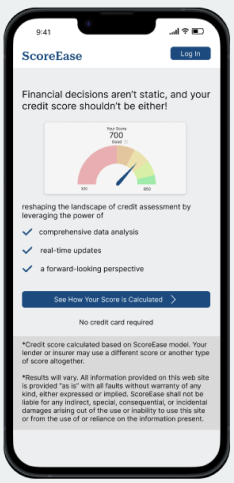
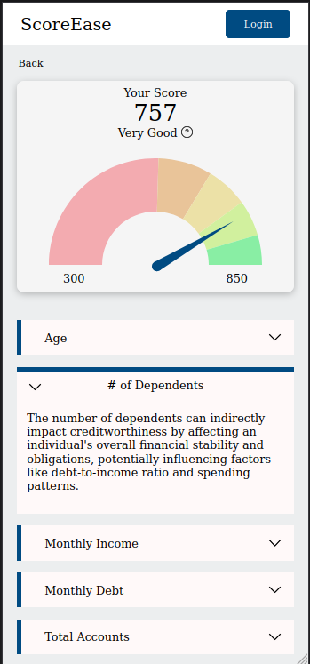
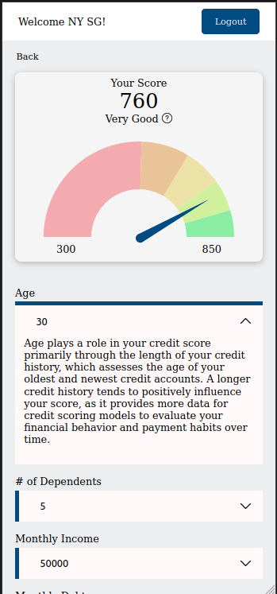

# 💸 Financial Literacy Hackathon 2023
*General Assembly Hackathon Summer August 14th 2023*

***Result: 1st Place***

## Hackathon Prompt

Create a more complete, data-driven, real-time credit score software that considers a borrower's finanacial and credit history from the beginning of time and can be used to qualify borrowers for credit and loans. Nice to have features can include: consider bill payments, rent, utilities, subscriptions, and visualization of data.

## Description

Embark on a seamless credit journey with our innovative web application. ScoreEase introduces a user-friendly interface that seamlessly combines the power of real-time data analysis with the entirety of your financial history. Say farewell to complex credit assessments and embrace a new era of simplicity and accuracy, as ScoreEase effortlessly allows borrowers to view credit and loans by tapping into their complete financial narrative, all at your fingertips.

## Github Repository Links
- Frontend Repo: https://github.com/Jagerziel/Credit_Score_App_Frontend
- Backend Repo: https://github.com/krsnamara/Credit_Score_App_Backend
- Data Modeling Repo: https://github.com/codewithkate/Credit_Score_App_Model

## Application Screenshots
**Home Screen**

*The landing screen when the application first loads.  The user has the option of logging in or navigating to the dashboard screen to further explore the application*  

**Dashboard Screen (Logged Out)**: 

*The user has the option of logging in or reviewing the different categories they would need to fill to obtain an estimated credit score*

**Dashboard Screen (Logged In)**

*Once the user logs in, they are greeted at the top of the application and the input fields appear allowing them to input the relevant information to determine their scores.*

## Approach

### Front-End Dependencies

 - axios
 - firebase
 - framer-motion
 - react
 - react-dom
 - react-router-dom
 - recharts
 - sass

# 💻 Full Stack Technologies Used

- HTML5
- CSS3
- JavaScript
- React
- Express
- Python
- MongoDB
- Figma
- Git/Github
- Nodejs
- Vercel

## Future Features

- Info modals for explanations on credit scores

## Team

**Alaysia Veal (Software Engineer)**
[LinkedIn](https://www.linkedin.com/in/alaysia-veal/)
[GitHub](https://github.com/AlaysiaVeal)

**Kimberly Mannette (UX/UI Designer)**
[LinkedIn](https://www.linkedin.com/in/kimberlymannette/) |
[GitHub](https://github.com/kimberlymannette)

**Kate Crawford (Data Science Engineer)**
[LinkedIn](https://www.linkedin.com/in/kaitlencrawford/) |
[GitHub](https://github.com/codewithkate)

**Mark Harris (Data Science Engineer)**
[LinkedIn](https://www.linkedin.com/in/markcharris1/) |
[GitHub](https://github.com/MarkCHarris)

**Martin Fitzpatrick (Software Engineer)**
[LinkedIn](https://www.linkedin.com/in/martinj-fitzpatrick/) |
[GitHub](https://github.com/krsnamara)

**Ryan Ehrlich (Software Engineer)** 
[LinkedIn](https://www.linkedin.com/in/ryanehrlich/) |
[GitHub](https://github.com/Jagerziel)